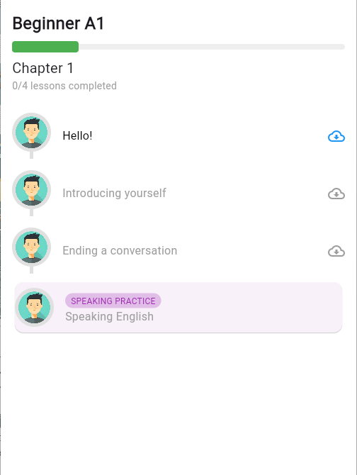

# Fullscreen Video App

A Flutter application that provides an interactive learning experience through video content and speech recognition. The app includes a learning module with lessons, progress tracking, and speaking practice features.

## Features

- **Fullscreen Video Playback**: Watch educational videos in fullscreen mode.
- **Speech Recognition**: Use speech-to-text functionality to interact with the app.
- **Dynamic Learning Module**: Access various lessons with progress tracking.
- **User-Friendly Interface**: Intuitive design for easy navigation and interaction.

## Screenshots

### Fullscreen Video Screen
https://github.com/user-attachments/assets/ed868b1b-8333-41c9-81fb-071aff3a45b9

### Learning Module Screen


## Getting Started

To get started with this project, follow the instructions below.

### Prerequisites

- Flutter SDK installed on your machine.
- An IDE such as Android Studio, Visual Studio Code, or IntelliJ IDEA.

### Installation

1. Clone the repository:
   ```bash
   git clone https://github.com/yourusername/fullscreen_vedio_app.git
   cd fullscreen_vedio_app
   ```

2. Install the dependencies:
   ```bash
   flutter pub get
   ```

3. Run the app:
   ```bash
   flutter run
   ```

### Usage

- Launch the app on your device or emulator.
- Navigate through the learning module to access different lessons.
- Use the microphone feature to practice speaking and see the speech recognition in action.

## Contributing

Contributions are welcome! If you have suggestions for improvements or new features, feel free to open an issue or submit a pull request.

## License

This project is licensed under the MIT License. See the [LICENSE](LICENSE) file for details.

## Acknowledgments

- [Flutter](https://flutter.dev/) - The framework used for building the app.
- [Speech to Text](https://pub.dev/packages/speech_to_text) - Package for speech recognition.
- [Video Player](https://pub.dev/packages/video_player) - Package for video playback.
